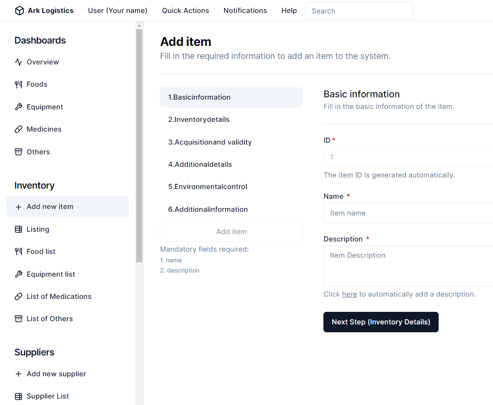

# Ark Technology Solutions

Welcome to the Ark Technology Solutions repository. This repository contains the core projects that make up the Ark Ecosystem, designed to build a self-sustaining, resilient organization. 

## Table of Contents

- [Projects](#projects)
  - [Ark Brain](#ark-brain)
  - [Tobias](#tobias)
  - [Ark Logistics](#ark-logistics)
  - [Cake](#cake)
  - [BunkerSim](#bunkersim)
  - [Muffin](#muffin)
  - [Ark FarmTool](#ark-farmtool)
  - [HDs](#hds)
  - [Ark Vault](#ark-vault)
  - [Sítio](#sítio)
- [Technologies Used](#technologies-used)
- [Contributing](#contributing)
- [License](#license)

## Projects

### Ark Brain
The Ark Brain is an advanced AI-driven system at the heart of Ark Technology Solutions, orchestrating and optimizing all aspects of the company's operations through a network of intelligent agents. It seamlessly manages resource allocation, task scheduling, predictive maintenance, and strategic planning, ensuring efficient coordination across all project initiatives. Continuously learning and adapting, the Ark Brain enhances its performance over time, providing data-driven insights and real-time decision-making capabilities to create a robust, self-improving ecosystem for long-term sustainability and resilience. It will be available to the public as a product in the future.

### Tobias
Tobias is our virtual assistant, designed to manage and communicate within the Ark Ecosystem. It interacts with various functionalities based on user permissions.

**Technologies Used:**
- Language: Python
- Framework: PyTorch
- AI Model: Multiple SOTA OS models are being considered and used 

### Ark Logistics
Ark Logistics is our inventory management system, crucial for maintaining a balanced supply of essential resources like food, water, and medical supplies.

**Technologies Used:**
- Backend: Next.js
- Database: PostgreSQL
- Frontend: React
- Style: Tailwind, Shadcn/ui
- ORM: Prisma

### Cake
Cake is our administrative management system, handling the operation of defense systems, population management, network access, logs, and sector reports.

**Technologies Used:**
- Backend: Next.js
- Database: PostgreSQL
- Frontend: React
- Style: Tailwind, Shadcn/ui
- ORM: Prisma

### BunkerSim
BunkerSim is a bunker simulator that uses real-world software to test and train operators on various crisis scenarios and the functionalities of our systems.

**Technologies Used:**
- Backend: Next.js
- Database: PostgreSQL
- Frontend: React
- Style: Tailwind, Shadcn/ui
- ORM: Prisma

### Muffin
Muffin is our social network platform for the Ark Ecosystem, featuring upvotes/downvotes, real-time chat, comments, profiles, groups, post recommendations, and customizable features unlocked by credits.

**Technologies Used:**
- Backend: Next.js
- Database: PostgreSQL
- Frontend: React
- Real-time: WebSocket (considering libs)
- Style: Tailwind, Shadcn/ui
- ORM: Prisma

### Ark FarmTool
Ark FarmTool helps manage the generation of food through agricultural and animal farming within the Ark Ecosystem.

**Technologies Used:**
- Backend: Next.js
- Database: PostgreSQL
- Frontend: React
- Style: Tailwind, Shadcn/ui
- ORM: Prisma

### HDs
HDs is the name of our group of HDs containing free entertainment resources like books, movies, games, animations, ai models, technologies and more.

**Technologies Used:**
- File system: NFTS

### Ark Vault
Ark Vault is our mini guidebook to prepare for crisis and how to use the Ark Ecosystem in your favor in all stages of a post-collapse situation.

**Technologies Used:**
- Text: Markdown and Plaintext

### Sítio
Sítio is the core project, aimed at creating a self-sustaining, resilient site for the community, consisting of three phases: initial setup, expansion with a bunker and additional houses, and developing a larger self-sustaining community.

**Technologies Used:**
- Various technologies across different phases

## Technologies Used

We prioritize the use of well-known, open-source software to ensure transparency, security, flexibility, and better maintainability. The specific technologies used in each project are detailed above.

## Contributing

We welcome contributions from the community. Please read our [Contributing Guidelines](CONTRIBUTING.md) for more information.

## License

This project is licensed under the MIT License. See the [LICENSE](LICENSE) file for details.
